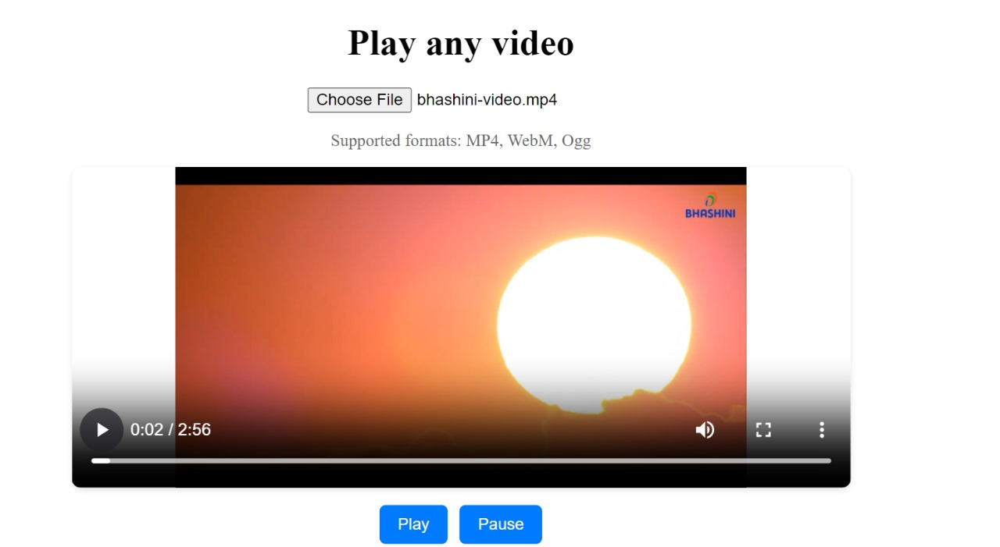

# Angular Content Player

## Overview

This project is an Angular-based video player application designed to handle video of different format. The application consists of two main components:

1. **Demo Videos Component**: This component contains a selection of pre-added demo videos in various formats (MP4, WebM, Ogg) stored in the `assets` directory.


2. **User Upload Component**: This component allows users to upload and play videos in any supported format.



## Features

- Play pre-loaded demo videos in multiple formats.
- We have options to Load,Play and Pause video
- Upload and play user-selected videos.
- Support for common video formats such as MP4, WebM, and Ogg and many more .

## Tech Stack

- Angular Framework
- Typescript
- Css(For basic Design)
- Html
- jasmine(for E2E & Unit Testing)

## Installation

1. **Clone the repository:**

    ```bash
    git clone https://github.com/your-username/angular-content-player.git
    cd angular-content-player
    ```

2. **Install dependencies:**

    ```bash
    npm install
    ```

3. **Run the application:**

    ```bash
    ng serve
    ```

4. **Open your browser and navigate to:**

    ```
    http://localhost:4200
    ```

## Demo Video


